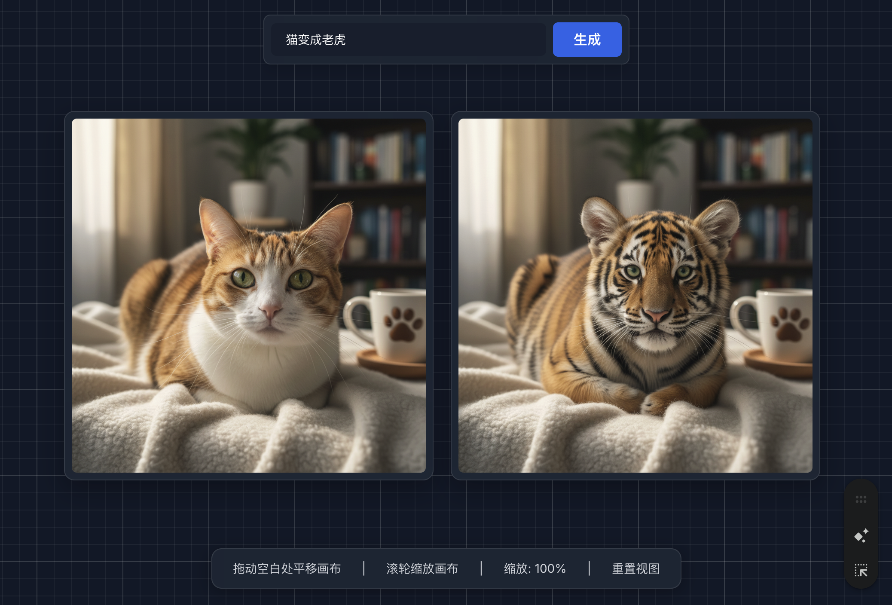

# Hello Agent: 3步构建AI无限画布教程

本教程将指导你如何通过与 Gemini 对话，使用三个核心指令（提示词）来构建一个功能完备的 AI 无限画布应用。这个画布不仅支持基础的拖拽、缩放功能，还能集成 AI 模型（以 "nano banana" 为例）进行文生图和图生图的操作。

---

## 步骤一：搭建无限画布的基础形态

我们的第一个目标是建立一个可以无限拖动和缩放的画布基础。

**➡️ 向 Gemini 发送以下指令：**

```

帮我创建一个无限画布的界面，背景是网格，我可以拖动图片到画布中，并且可以等比例的缩放、挪动这些图片。此外，需要增加画布整体的缩放逻辑。画布的样式简洁和高级，参考2025年流行设计趋势。

```

为了确保交互的稳定性和精确性，我们必须补充以下关键技术要求，以保证缩放和移动的中心点计算正确。

**➡️ 紧接着补充以下技术要求：**

```

需要注意，移动和缩放，必须相对鼠标的中心（或者双指的坐标平均中心），并且需要计算好画布的当前移动位置，当缩放之后，需要记录当前缩放比例，矫正计算缩放的中心位置，确保多次缩放和移动之后，仍然可以稳定的进行交互。

```

**✅ 阶段成果：**
此时，一个具备基础形态的画布就搭建好了，但它暂时还没有 AI 功能。


## 步骤二：集成 AI 文生图功能

接下来，我们在画布上添加一个操作区域，让用户可以通过输入提示词来生成图片。

**➡️ 向 Gemini 发送以下指令：**

```

在画布的下方中间的位置，添加一块操作区域，包含输入框和按钮，可以允许用户输入提示词，来生成图片，并把生成好的图片，在画布中展示。图片生成请使用 nano banana。

```

**✅ 阶段成果：**
一个能够生成图片的 AI 无限画布就搭好了。


---

## 步骤三：实现 AI 图生图（改图）功能

"nano banana" 模型的一个核心能力是“以图生图”。我们将实现：当用户选中一张图片时，输入的提示词将用于修改这张图片。

**➡️ 向 Gemini 发送以下指令：**

```

当画布中有图片被选中的时候，用户再输入提示词，则会启用 nano banana 的以图生图模式，将按照用户的提示词要求，来改图。请实现这个功能。

```



---

## 总结

恭喜！通过以上三个步骤，我们大约只花费了10分钟，就完成了一个功能强大的“香蕉无限画布”。
