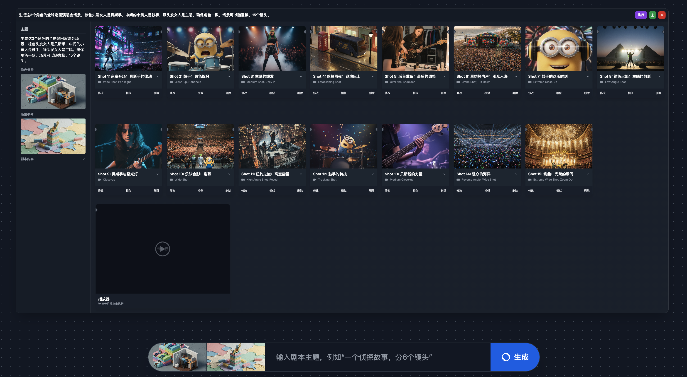
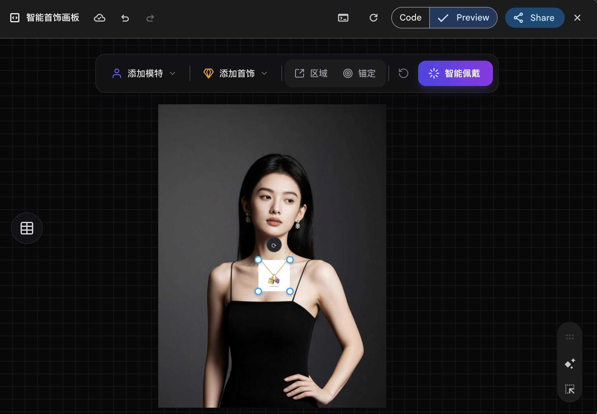
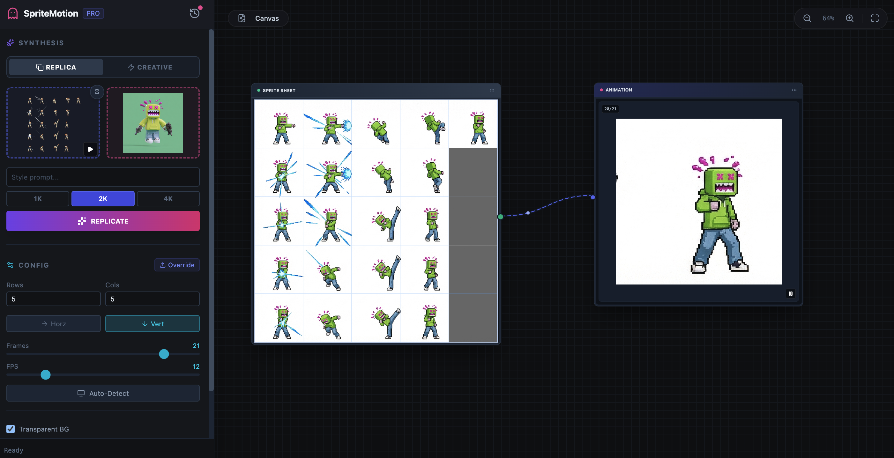
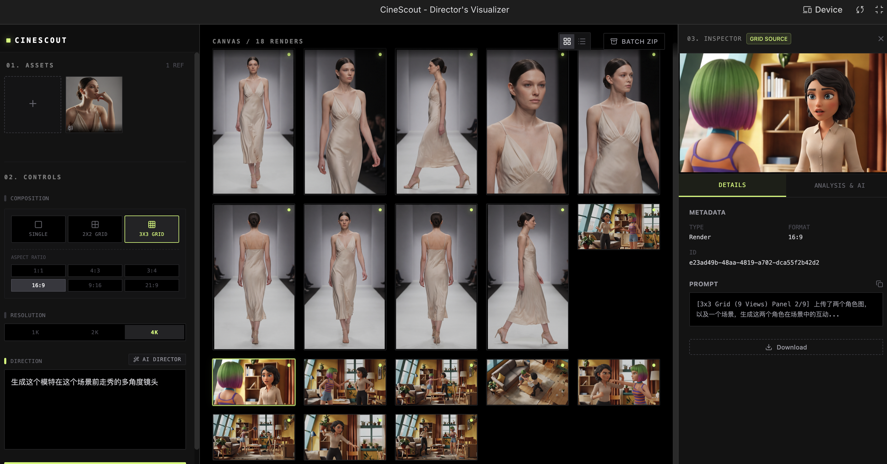

# Vibe-Agent
> 手搓Agent系列教程，包括开源画板，基于Gemini、Nano Banana的多模态驱动智能生成模式的探索。

B站课程专栏：[VibeAgent](https://www.bilibili.com/cheese/play/ss411001493)

**使用方法：**

- 1.直接打开share链接（需要在gemini登陆的状态下），可以直接使用；点击右下角的“Copy Canvas”可以创建一个自己的Canvas副本。
- 2.将html文件下载到本地，新开一个Gemini对话，启用Canvas模式，将html文件上传，要求直接用Canvas运行。

## Nano Banana Base
运行于Gemini生态，原生调用Nana Banana图片引擎，可视化，可自定义功能模块的画布Agent

- ### 1.剧本大师(frame_master.html)
  

  Gemini在线版：需要在Gemini环境下运行
  - [Gemini在线版](https://gemini.google.com/share/4ce52840bc5e)

- ### 2.即梦无限多帧画板（更新中）
  

- ### 3.珠宝首饰佩戴大师4k版
   
 - [Gemini在线版](https://gemini.google.com/share/221db03bda79)

- ### 4.NanoBananaPro神级应用：表情包大师
  
- [aistudio工程仓库](https://ai.studio/apps/drive/1gq6lc7EltuPS9Im5cZME-zTOi0lhNN7C?fullscreenApplet=true)

- ### 5.NanoBananaPro神级应用2：影视分镜终极解决方案
  
- [aistudio工程仓库](https://ai.studio/apps/drive/1ZfAW7_gZz8T7X73W82p3ZHUPLkenU7se)
